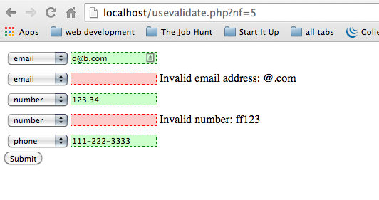

# Milestone 3: PHP Project
###Validator Tester

## Project Background and Description
Create a simple html form with username, password, email, and phone number. Using PHP, create classes that use regular expressions to implement a set of validators. The user will see the background of the input field turn green if it is valid or light red if it is not valid. If the user inputs invalid information, he/she will also get a message next to the input field that reads "Invalid {{field name}} : {{user input}}". For example, if the user submits k@test for an email, the background of the email field will turn light red and the message next to it will read: "Invalid email: k@test".

This project is meant to focus on php code. With that said, do not be concerned about the visual aspects of your page. You are free to play around with the *look* once the project is **fully** functional. 

## Project Scope

## Acceptance Criteria
You need to create the following classes that will be used to perform validation of the text inputs:
- Validator: this is the parent class of all the "concrete" validator sub-classes
- EmailValidator: validate an email address
- UsernameValidator: validate a username
- PasswordValidator: validate a password
- PhoneValidator: validate a phone number

Your project should have, at least, the following two files:
- super_validator.php: this will be the main "front-end" to your project that includes the html
- validator.php: this file will contain the validation related class as described in the "Validation" section of this document.
- For each text field:
  - If the text is valid your program will:
    - populate the text field with the input value
    - add some kind of CSS styling that indicates that the value is valid
  - If the text is **NOT** valid your program will: 
    - leave the text field blank and have an error message to its right that includes the erroneous value
    - add some kind of CSS styling that indicates that the value is **NOT** valid

The input fields of the form will look like this (ignore the drop down boxes, the left side will simply be labels):

### Validation Specifications:
- email:
  - must contain one and only one '@' character
  - there must be at least one character to the left of the '@'
  - to the right of the '@' there must be one or more alpha characters, a '.', then upto 5 alpha characters
- username:
  - must be at 4-6 characters long
  - must contain only alpha-numeric characters and '-' or '_'
- password:
  - must be 4-12 characters long
  - must contain alpha AND numeric characters and optionally contain any of [!@#$%^&*()<>?]
- phone number:
  - must be of this format: NNN-NNN-NNNN where each N is a decimal digit
- number:
  - must contain at one or more digits
  - may contain a '.', but not as the last character
  - may contain a '-' as the first character

### Tips
- get started NOW!
- start simple, do the simplest thing you can to get started, then move onto the next simplest thing, repeat...
- test your program after each step above
- use git, checkin your code each time you get something working
- ask questions, don't get stuck

### Order of Things:
1. don't worry about validation or classes to begin with. Start building the forms and making them work
1. Create a data structure to hold input names, values, & validity
1. Use above data structure to conditionally attach a CSS class to the inputs when you create them
1. Write the Validator class and **one** sub-class
1. Integrate the one sub-class into your project
1. One by one, write another Validator sub-class, then integrate it into your project
1. Smile and be very proud of yourself, you have just completed a **real** project!

